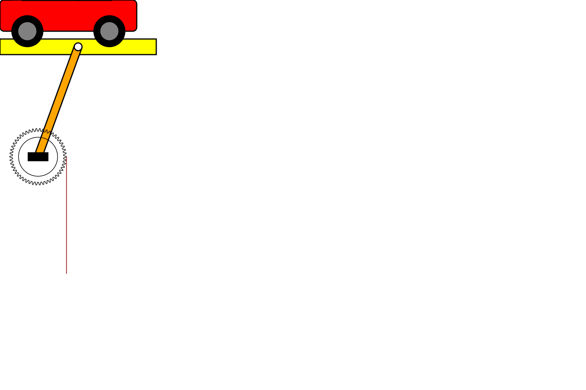
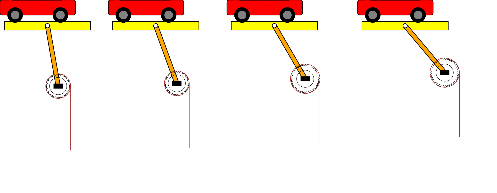
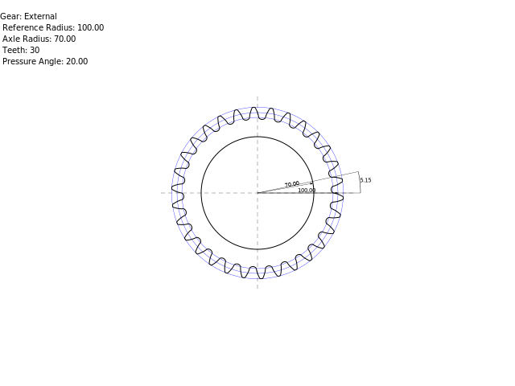
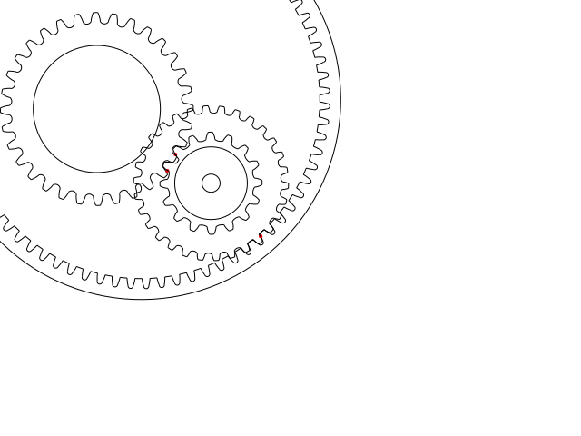

# TPA_Homework1
Homework of the advanced programming technique course!

Create a device, make it work!  
Create a machine using collegue device.  

# 
# Links
- [Usage](#usage)
- [Command line executable](#command-line)
- [Tests](#tests)
- [Connection](#connection)
- [Machine](#machine)

## Machines
Created machine using [Elia Bontempelli](https://github.com/eliabonte/Assignment1) and [Giacomo Corradini](https://github.com/GiacomoCorradini/TpaHomework1) devices.

## Complex Machines

## External Gear

## External with measures

## Gear Chain

# BUILD
Stay in root directory and run:
~~~
./compile.sh
~~~
This command will build codes and will place the executables in: ***bin*** folder.
To run tests:
~~~
./bin/tests
~~~
To run cmd_line:
~~~
./bin/cmd_line <params>
~~~
Params explained at [command line section](#command-line)

# USAGE
Before all...
## Parameters meaning:
### Eternal Gear
This is a boolean flag to set if the teeth will be on the outside or on the inside of the gear.
### Reference Radius
Also called Pitch radius.  
This is the reference to all the calculations, is not the radius defined by the tooth tip, and neither the radius defined by the tooth base, is in "the middle" of the teeth.
This radius is used when coupling multiple gears, is used to define the gear ratio.
### Axle Radius
If the gear has external teeth, this is the radius of the hole at the center.  
If the gear has internal teeth, this is the radius of the external circle.
### Teeth
Number of teeth that the gear will have
### Pressure Angle
Is an angle that defines the shape of the teeth, defines the direction of the force between two coupled gears. Usually setted at 20°

## Init
Initialization of a gear:
~~~C++
Gear* gear = init(external_gear, reference_radius, axle_radius, teeth, pressure_angle);
~~~
This function can return NULL if the gear parameters are not valid.  
See ***g_check_integrity*** function for details.
~~~C++
if(gear == NULL)
  // gear is not valid
~~~

## Setters functions
The gear can be modified with some setters functions.  
Basic setters:
~~~C++
g_set_external_gear();
g_set_reference_radius();
g_set_axle_radius();
g_set_teeth();
g_set_pressure_angle();
~~~
Can be used other kind of parameters to modify the gear.  
Others setters:
~~~ C++
g_set_modulo();
~~~

## Getters functions
Returns the values of the gear.  
As before some values are calculated by the main parameters.
~~~C++
g_get_external_gear();
g_get_reference_radius();
g_get_axle_radius();
g_get_teeth();
g_get_pressure_angle();
~~~
Calculated:
~~~C++
g_get_modulo();
g_get_addendum();
g_get_dedendum();
g_get_tooth_height();
g_get_pitch_angle();
g_get_alpha();
g_get_beta();
~~~

## Output functions
To print all the parameters of a gear use:
~~~C++
g_to_string(pointer_to_gear);
// output will be like

// Gear:
//   External gear: False
//   Reference radius: 115.000000
//   Axle radius: 250.000000
//   Teeth: 3
//   Alpha: 10.000000
~~~
To print also the calculated parameters use:
~~~C++
g_to_string(pointer_to_gear, true);
// Output will be like

// Gear:
//   External gear: False
//   Reference radius: 115.000000
//   Axle radius: 250.000000
//   Teeth: 3
//   Alpha: 10.000000
//
//   Base Radius: 113.252892
//   Modulo: 76.666667
//   Addendum: 76.666667
//   Dedendum: 95.833333
//   Tooth height: 172.500000
//   Beta: 59.897208
//   Alpha: 0.102792
~~~

## SVG
To **export** a gear in a svg file use:
~~~C++
g_export_svg(pointer_to_gear, path+filename, with_measure);
~~~
If with measure is set to true, the drawing will have all the measures.  
This flag also kills all the animations.  
This function will create a file as the one shown on top.  
***Filename must be without extension***.  
The function does not check if the path exists.

To **load** a gear struct from a svg use:
~~~C++
Gear* g_from_svg(path+filename);
~~~
The function firstly check if the file exist.  
Then loads all the parameters and initializes a gear.  
If the function fails will return NULL.  
The fails can be because the file doesn't exists or because some parameters were missing/wrong.

# Tests
The test.cpp will iterate generating some random gears, some will be valid, some other will be invalid.  
Each valid gear will be exported to svg, then will wait one second and then will start a new iteration.  
**Open gear.svg in a browser** and run **test**, reload the page each second to see the gear changing on each iteration.  

To run **REAL** cheks run
~~~bash
./bin/GearTest
~~~

# Command line
main.cpp has some code to create, load, export a gear from command line.  
To use it run:
~~~
./main <params>
~~~
All the parameters can be found here.  
~~~
-h to display this help

Gear parameters:
<external gear> <reference radius> <axle radius>  <teeth number> <pressure angle>
(0 or 1)        (double value)     (double value) (int value)    (double value °)

File parameters:
-o <path> path for svg output file
-l <path> path for svg load file
-m is to use measures when exporting svg file

When using -l option the parameters passed as arguments are not used, will be used
the parameters contained in the file loaded!
~~~

# Connection
To create a connection between two gears is enough having those two gear structs and define a connection angle.  
gear1 and gear2 are pointers to Gear struct, angle is a double (in degrees).  
~~~C++
g_init_connection(gear1, gear2, angle);
~~~

To have a cood connection the two gears must have the same modulo and the same pressure_angle.  
To create a gear with the right parameters use:
~~~C++
g_init_for_connection(Gear* gear1, external_gear, reference_radius, axle_radius);
~~~
If the init function succeed then the connection will be perfect.

## Chain
A connection struct can have a next connection, so the first connection can be linked with another connection.  
To do that use:  
~~~C++
g_set_next_connection( connection1, connection2);
~~~
This function will append connection2 to the last element of connection1.  
connection1 is a double pointer to Connection struct. connection2 is a pointer to Connection struct.  

Example can be found in **scripts/connection.cpp**

# Machine
To create a machine import **Machine.h**
then use this simple code:
~~~C++
// Ready to use machine
PhilMachine* machine = phil_init_default_machine();
// Create svg string
string machine_svg = phil_machine_to_svg(machine);
// Export in svg file
g_export_svg(machine_svg, "output/machine");
~~~
  
~~~C++
// Create your own
PhilMachine* machine = phil_init_machine(400, 50, 350, 10)
// Parameters:
//  Gru height
//  Elevation speed
//  Car width
//  Arm angle
~~~

Can be also declared an array of machines... a **complex machine**:
~~~C++
size_t size = 2;
// Create dynamically an array
PhilMachine** complex_m = new PhilMachine* [size];
// Fill it
complex_m[0] = phil_init_machine(400, 50, 350, 10);
complex_m[1] = phil_init_machine(400, 80, 350, 10);
// Specify the array size
string complex_machine = phil_complex_machine_to_svg(complex_m, size);
g_export_svg(complex_machine, "output/complex_machine");
~~~

Better explanations of the parameters can be found in **include/Machine.h**.  