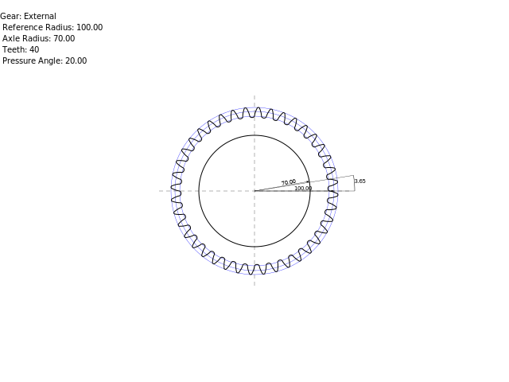

# TPA_Homework1
Homework of the advanced programming technique course!

## Gear
Create a gear from minimum given parameters.  
Export, if needed, as .svg file.

## Example
This drawing is not generated, is an example of how the gear should look  

This drawing is generated!!

